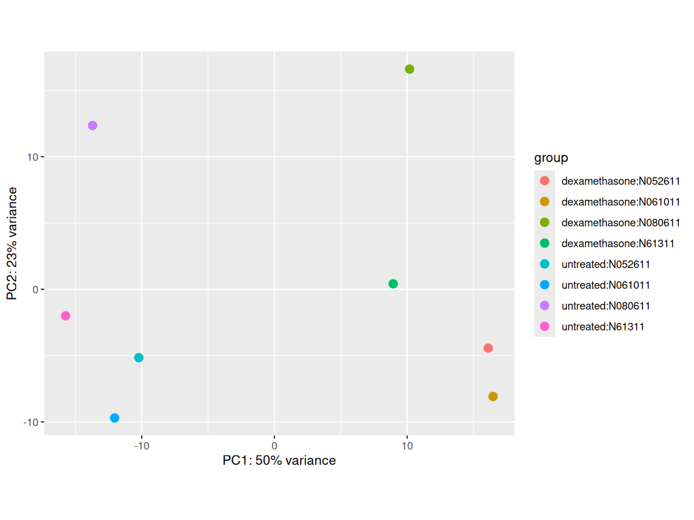
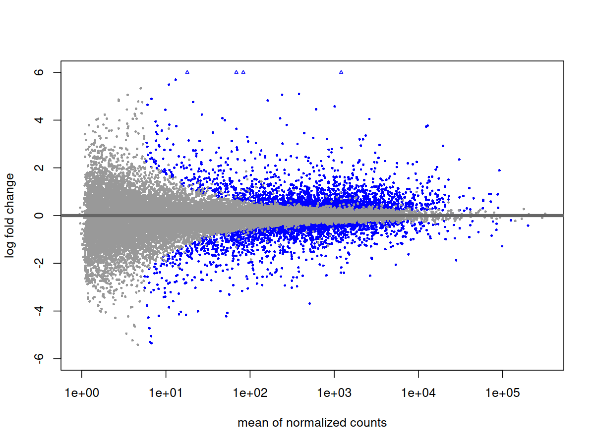
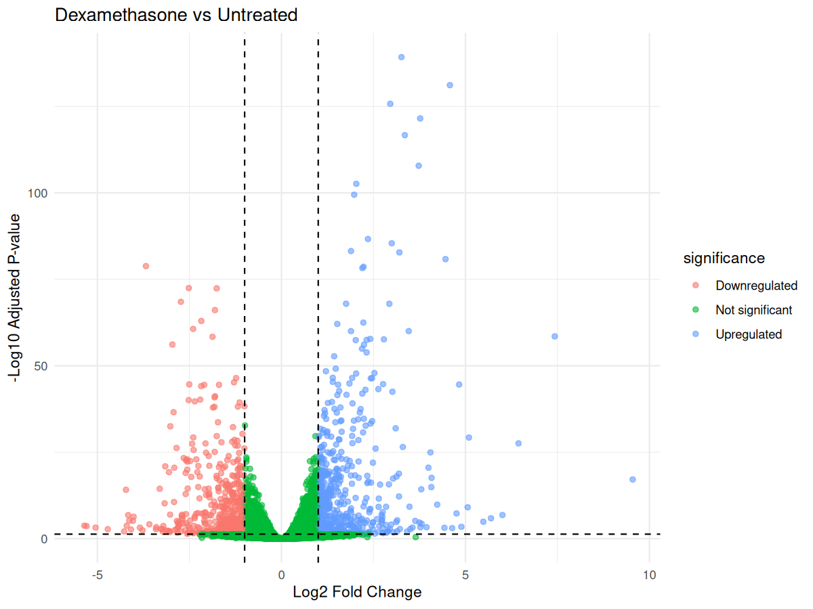
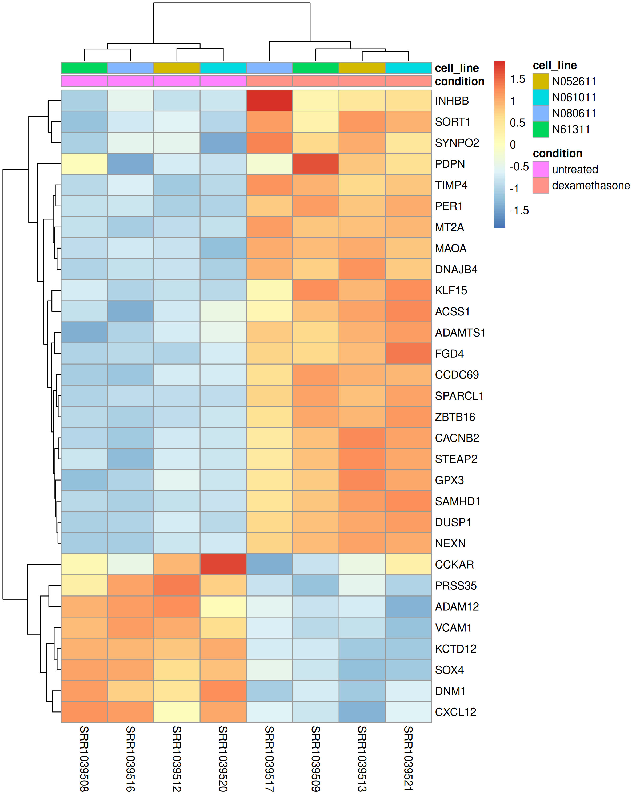

# RNA-Seq Differential Expression Pipeline

End-to-end bulk RNA-seq analysis of dexamethasone-treated and untreated human airway smooth muscle cells using public sequencing data from GSE52778.

## Objective

Identify gene expression changes associated with dexamethasone treatment while accounting for baseline differences between cell lines.

## Experimental Design

Eight paired-end RNA-seq samples were analyzed:

- 4 untreated samples
- 4 dexamethasone-treated samples
- 4 human airway smooth muscle cell lines
- Each cell line contributed one untreated and one treated sample

DESeq2 design:

```r
~ cell_line + condition
```

Including `cell_line` accounts for baseline expression differences between cell lines while estimating the dexamethasone treatment effect.

## Workflow

```text
SRA metadata
    ↓
SRA → paired-end FASTQ
    ↓
FastQC / MultiQC
    ↓
HISAT2 alignment to hg38
    ↓
SAMtools sorted BAM
    ↓
featureCounts + GENCODE v50
    ↓
Gene count matrix
    ↓
DESeq2
    ↓
Differential expression
    ↓
PCA / MA plot / Volcano plot / Heatmap
    ↓
GO Biological Process enrichment
```

## Tools

- SRA Toolkit
- FastQC
- MultiQC
- HISAT2
- SAMtools
- featureCounts
- R
- DESeq2
- AnnotationDbi / org.Hs.eg.db
- ggplot2
- pheatmap
- gprofiler2
- Bash
- Git / GitHub

## Results

After low-count filtering, **23,391 genes** were analyzed.

At `padj < 0.05`:

- **3,879** differentially expressed genes
- **2,167** upregulated
- **1,712** downregulated

Using the stronger threshold `padj < 0.05` and `|log2FC| >= 1`:

- **1,049** genes remained
- **540** upregulated
- **509** downregulated

### PCA

PC1 explained **50.3%** of expression variance and strongly separated untreated and dexamethasone-treated samples.

PC2 explained **23.0%** of the variance and captured additional variation between samples.



### MA Plot



### Volcano Plot

The volcano plot shows genes with both substantial expression changes and strong statistical evidence.



### Top Differentially Expressed Genes

The top 30 differentially expressed genes showed clear treatment-associated expression patterns across the samples.



## Functional Enrichment

GO Biological Process enrichment was performed using `gprofiler2`.

Genes tested by DESeq2 were used as the background gene set.

Prominent enriched categories included:

- Signaling
- Signal transduction
- Cell communication
- Response to stimulus
- Cell differentiation
- Developmental regulation

Full results are available in:

`results/differential_expression/go_enrichment_results.csv`

## Repository Structure

```text
.
├── data/
│   └── metadata/
├── docs/
│   └── lab_notebook.md
├── results/
│   ├── alignment/
│   ├── counts/
│   ├── differential_expression/
│   └── qc/
├── scripts/
│   └── r/
└── README.md
```

## Reproducibility

Large sequencing files, BAM files, reference indexes, and the full featureCounts matrix are not stored in GitHub because of their size.

The repository retains the metadata, scripts, QC summaries, differential-expression results, figures, and documentation required to reproduce the workflow.

The R analysis can be rerun from the featureCounts matrix using:

```r
source("scripts/r/deseq2_analysis.R")
```

## Data Source

GEO accession: **GSE52778**

Organism: **Homo sapiens**

Cell type: **human airway smooth muscle cells**
